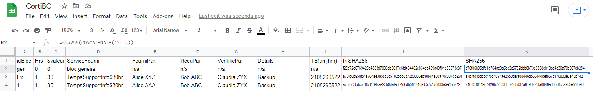

(Une version Francaise suit)  
This is a simple illustration of how blockchain technology [1] works. It is based on SHA256 [2] hashing to ensure data integrity by preventing tampering of past operations (any changes to any cell). Cells are hashed and each new block transaction integrates the hash of the previous transaction. This creates a connected chain of hashes. Any changes to previous data will break the chain at the point where the unauthorised change has been made and signal a loss of data integrity. This technique solves the "double spend" problem inherent to digital files, it prevents political corruption and enforces accountability.  
[1] Used in for example: Crypto currencies (Bitcoin); smart contracts (counterfeit prevention, provenance, traceability, web of trusts, etc); certification, regulatory compliance, auditing.  
[2] SHA256 is an algorithm used to map data of any size to a fixed length. It was developed and approved by the NSA for use by the US Government and military.  
[3] For more information (Documents and tools explaining the basis of BlockChain and Distributed Ledger Technologies and use cases) please see the project github here https://github.com/jean-francoisgiraud/BlockChainDLT  
#
Please click on the image below to see the image in its original size. Depending on your monitot size and resolution it may be scrollable.  

Veuillez cliquer sur l'image pour voir l'image dans sa taille originale. Selon la taille et la résolution de votre moniteur, il peut être défilant.  
#
Ceci est une illustration simple du fonctionnement de la technologie blockchain [1]. Il est basé sur le hachage SHA256 [2] pour garantir l'intégrité des données en empêchant la falsification des opérations passées (toute modification d'une cellule). Les cellules sont hachées et chaque nouvelle transaction de bloc intègre le hachage de la transaction précédente. Cela crée une chaîne connectée de hachages. Toute modification des données précédentes brisera la chaîne au point où la modification non autorisée a été effectuée et signalera une perte d'intégrité des données. Cette technique résout le problème de « double dépense » inhérent aux fichiers numériques, elle empêche la corruption politique et impose la responsabilité.  
[1] Utilisé par exemple dans : les monnaies crypto (Bitcoin) ; contrats intelligents (prévention de la contrefaçon, provenance, traçabilité, réseau de confiance, etc.) ; certification, conformité réglementaire, audit.  
[2] SHA256 est un algorithme utilisé pour mapper des données de n'importe quelle taille à une longueur fixe. Il a été développé et approuvé par la NSA pour être utilisé par le gouvernement américain et l'armée.  
[3] Pour plus d'informations (Documents et outils expliquant les bases des technologies BlockChain et Distributed Ledger et cas d'utilisation), veuillez consulter le projet github ici https://github.com/jean-francoisgiraud/BlockChainDLT  
